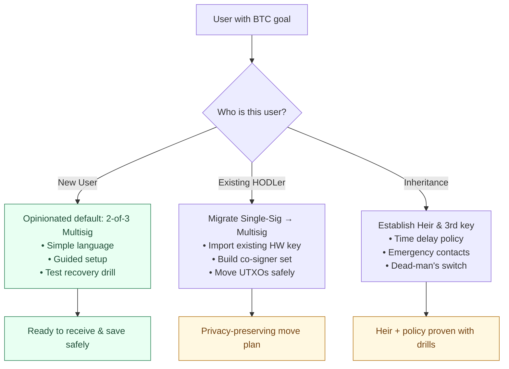
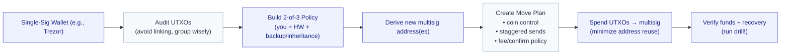
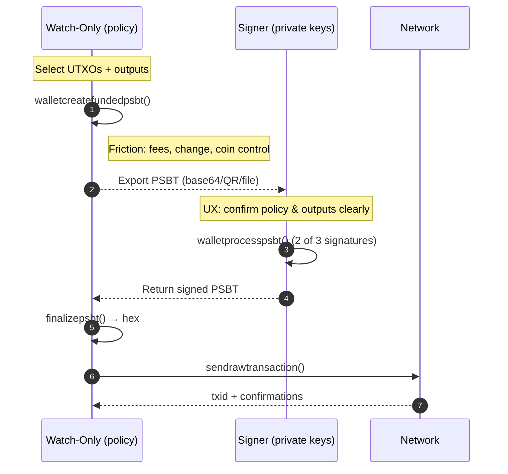
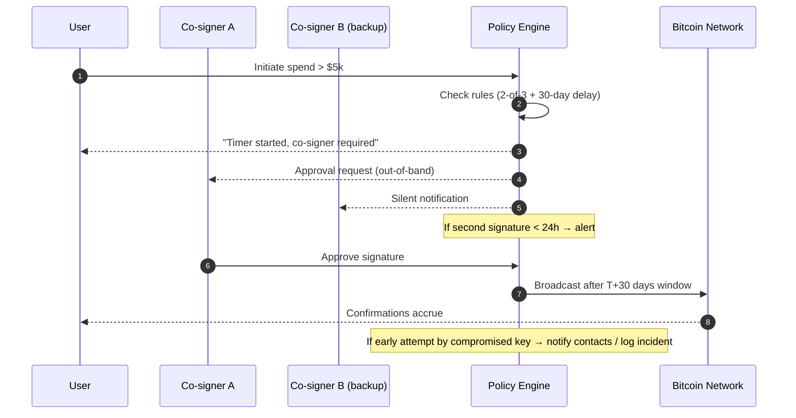
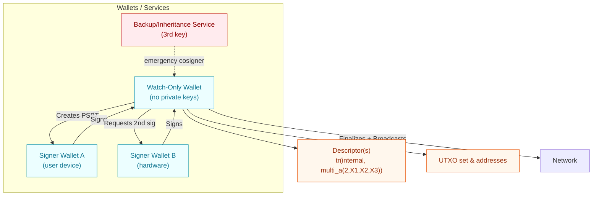
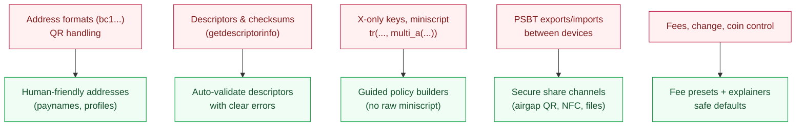
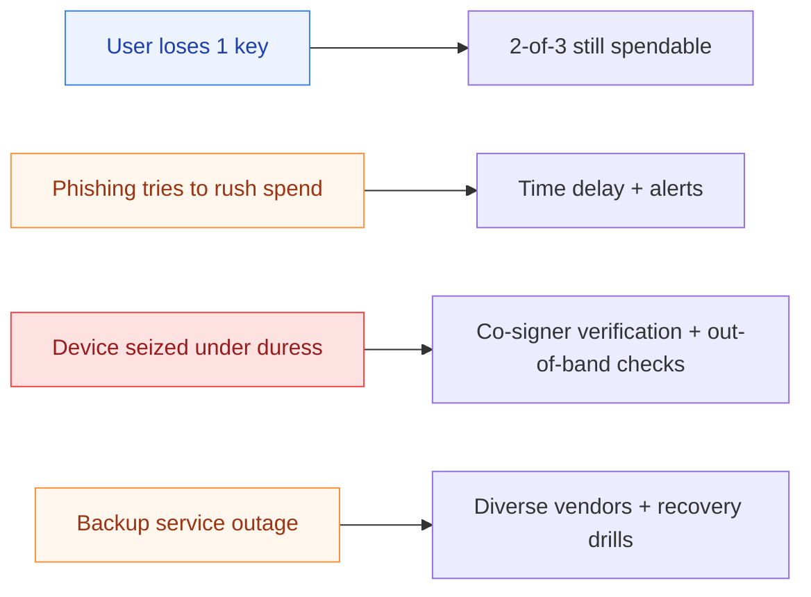
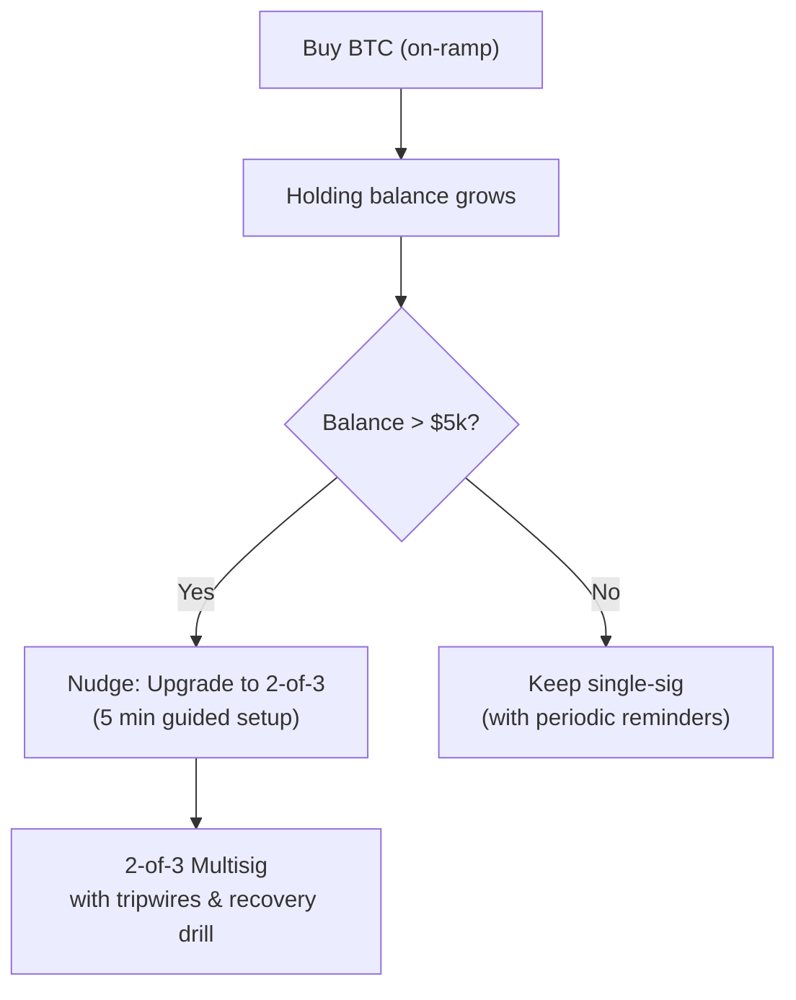
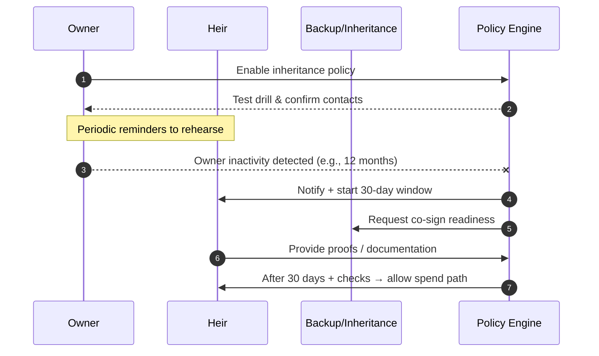

# Design Day Appendix: Bridging Bitcoin UX & Technical Flows

This document was created as a companion to [testnet4-bitcoin-cli-taproot-multisig](../).  
It reframes the **technical deep dive** into Taproot multisig + PSBTs as **design challenges** relevant to Presidio Bitcoin Design Week.

---

## 1. Context

**Event:** Presidio Bitcoin Design Week – Deep Dive  
**Theme:** "Can we design products and experiences that bring bitcoin to billions of users:  
while staying true to decentralization, self-sovereignty, resilience, adversarial thinking, and trust minimization?"

---

## 2. Relevance of This Repo

- This repo documents building a **2-of-3 Taproot multisig wallet** and spending flow *from scratch* via `bitcoin-cli`.
- It shows the *raw ingredients* behind wallets like Bitkey, Sparrow, or Electrum.
- By surfacing complexity (descriptors, x-only pubkeys, PSBT flow), it highlights where **designers must step in** to simplify.

---

## 3. Key Design Lenses

### a. Self-Custody & Safety
- **Problem:** Most users hold Bitcoin on single devices (Trezor, Ledger, phone apps). Single point of failure.
- **Insight from repo:** 2-of-3 multisig is safer, but extremely hard to build manually.
- **Design opportunity:** Create flows where users are guided into multisig *by default* when storing >$5k.

### b. Migration Pathways
- **Problem:** Many users already have BTC in single-sig wallets.
- **Question:** How to move coins into multisig **without revealing too much on-chain** or risking loss?
- **Design opportunity:** Silent migration wizards; inheritance modes; decoy time-lock alerts.

### c. UX for Adversarial Environments
- **Repo lesson:** Environment variables, cookie auth, descriptor checksums → all are brittle for normal people.
- **Design challenge:** How to ensure **no technical footguns** for people who just want to "store safely"?

---

## 4. User Journeys to Explore

- **New User, First $5k**  
  Guided into 2-of-3 with clear metaphors: "3 safes, any 2 to open."
- **Existing HODLer (Trezor owner)**  
  Assisted migration into multisig without full key exposure.
- **Inheritance**  
  Keys distributed to family/lawyers with **time-delay protections** (e.g., 30-day trigger, FBI alert if forced too soon).

---

## 5. How to Contribute in Design Day

- Incorporate background in **Google-scale UX research & user journeys**.  
- Ask: *Where would mom get stuck?* (e.g., faucet login failures → imagine Coinbase off-ramp friction).  
- Sketch: "From faucet to PSBT" is analogous to "From paycheck to secure savings."  
- Pair technical concepts (UTXOs, PSBT, descriptors) with **user metaphors** (piggy banks, safes, shared signatures).

---

## 6. Glossary (Designer-Friendly)

- **UTXO**: "Unspent transaction output" → like a dollar bill in Bitcoin form.  
- **Descriptor**: Recipe for how coins can be spent (who needs to sign).  
- **x-only pubkey**: Shortened key format in Taproot (only the x coordinate).  
- **Taproot**: Upgrade that hides complexity; can look like single-sig even if it's multisig.  
- **PSBT**: Partially Signed Bitcoin Transaction → a draft check passed around until enough people sign.  
- **Watch-only wallet**: Can see balance & build transactions, but cannot spend.  
- **Signer wallet**: Holds private keys, actually authorizes spend.

---

## 7. Next Steps

- Add **Mermaid diagrams** (optional) mapping:
  - Multisig migration flow (single-sig → multisig).
  - UX "friction points" vs. "automation opportunities."
- Align repo with **Grand Challenges of Bitcoin Design**:
  - Branding  
  - On-/off-ramps  
  - Self-custody  
  - Addressing & identity  
  - Units & privacy

---

### A) Journey Overview: New User vs Existing HODLer vs Inheritance

### B) Migration Flow: Single-Sig → 2-of-3 Multisig (Privacy-aware)

### C) PSBT Flow Annotated (Where UX friction hides)

### D) Security Tripwires (Time-Delay + Early-Spend Alerts)

### E) Roles & Key Custody (Separation of Powers)

### F) Friction Map (Where beginners get stuck)

### G) Risk Matrix (Likelihood × Impact)

### H) On/Off-Ramp & “Upgrade to Safety” Nudges

### I) Inheritance Journey (30-day policy example)

## 8. Closing Thought

This repo shows how hard it is to build safe Bitcoin storage with raw tools.  
**The design challenge:** Make 2-of-3 multisig as simple as Venmo *without violating self-sovereignty*.  
That’s the contribution we can make at Presidio.

---