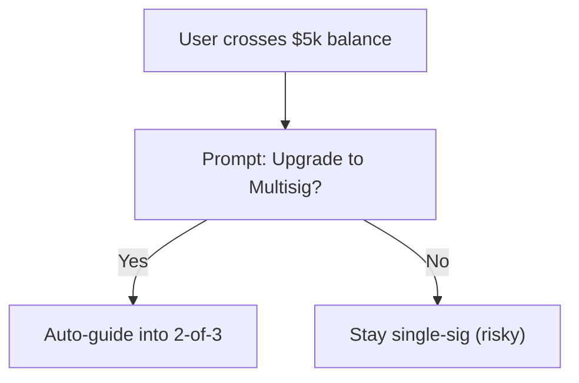
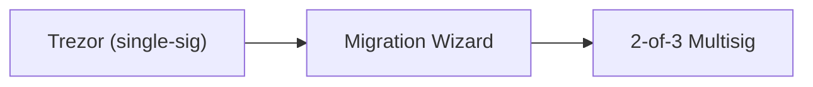
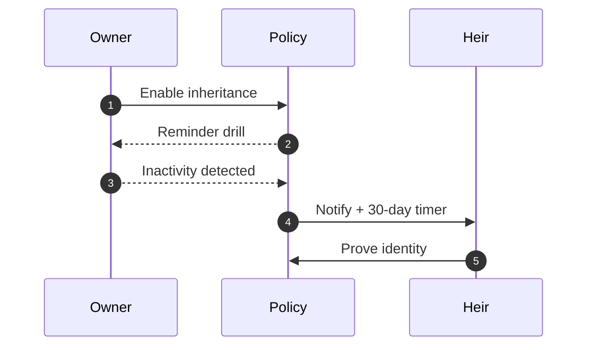
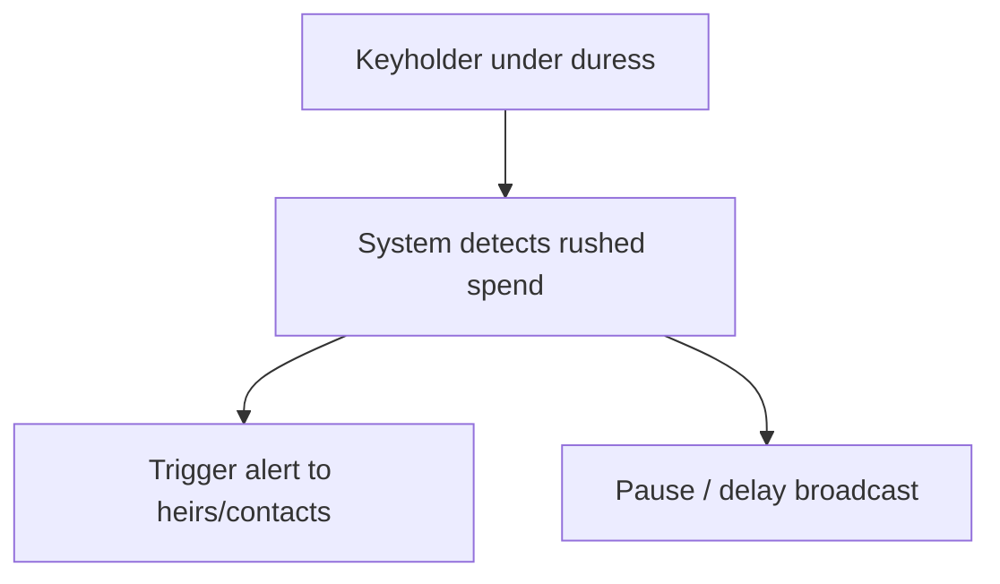
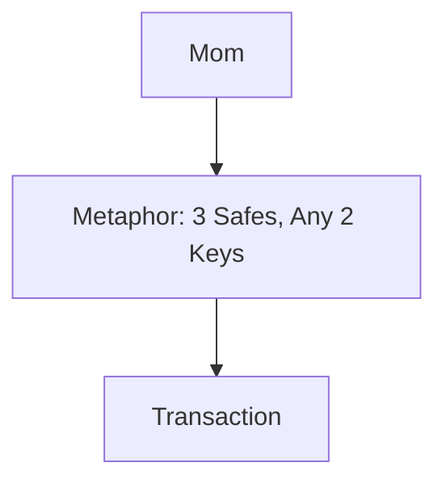

# Workshop Prompts (Design Provocations)

These are not answers — they’re **friction points** phrased as questions to provoke design ideas.
Each section includes a small Mermaid diagram we can screen-share or print as a breakout prompt.

---

## A) Self-Custody Defaults

- Should wallets **force multisig** above certain balances (>\$5k)?
- How do we design defaults that protect users **without removing choice**?

## B) Migration Pathways
	•	How can users safely move coins from existing single-sig wallets into multisig?
	•	How do we hide complexity like descriptors, PSBTs, and x-only pubkeys?

## C) Inheritance & Time-Delay
	•	Can we design time-delays + alerts that don’t overwhelm normal users?
	•	How should heirs rehearse recovery without touching real funds?

## D) Adversarial UX
	•	What happens when a keyholder is compromised or coerced?
	•	How do we make “call the FBI” triggers or alerts without false positives?

## E) Education & Metaphors
	•	What metaphors make Bitcoin multisig “mom proof”?
	•	“3 safes, need 2 keys”
	•	“Shared signatures = shared trust”
	•	How do we explain descriptors/PSBT in plain mental models?

---

# Proposed approach:

	•	Print one section per page for breakout groups.

	•	Ask teams to sketch the happy path, then annotate failure paths and countermeasures.

	•	Map each idea back to wallet primitives (UTXO, descriptor, PSBT, key custody).
