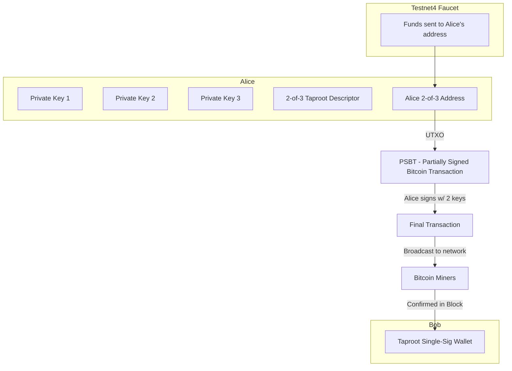
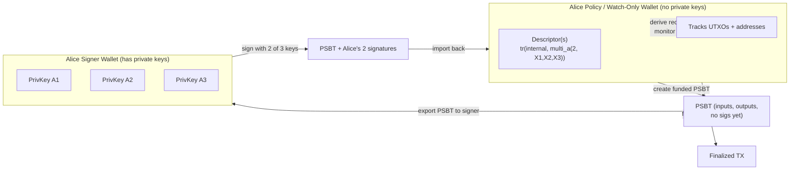
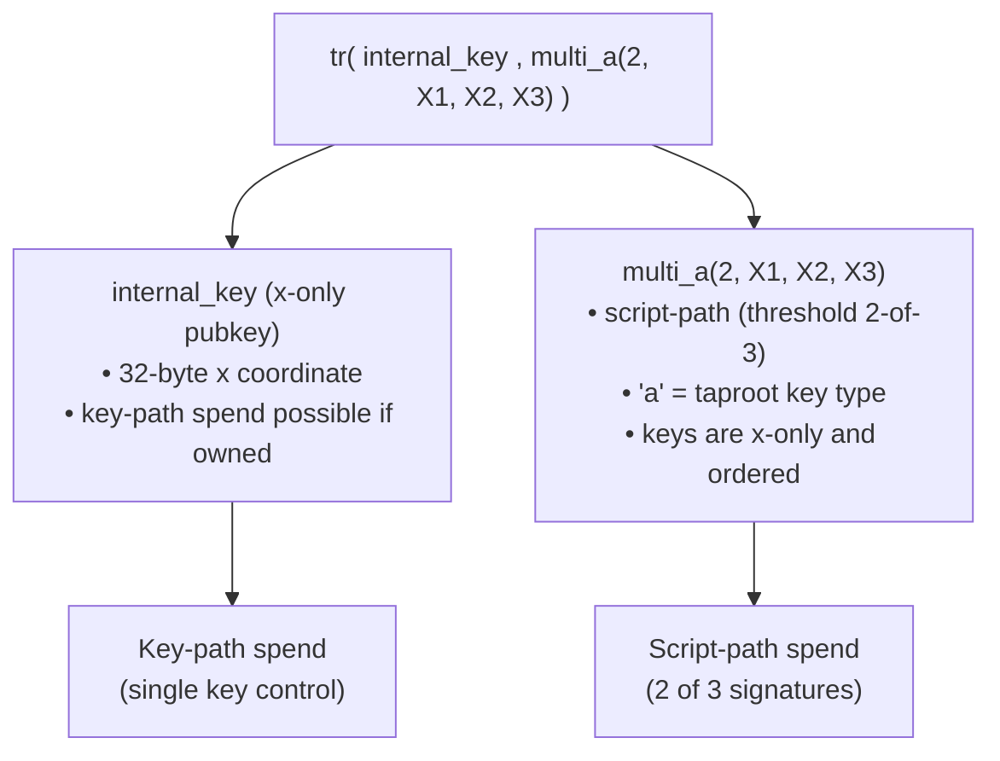
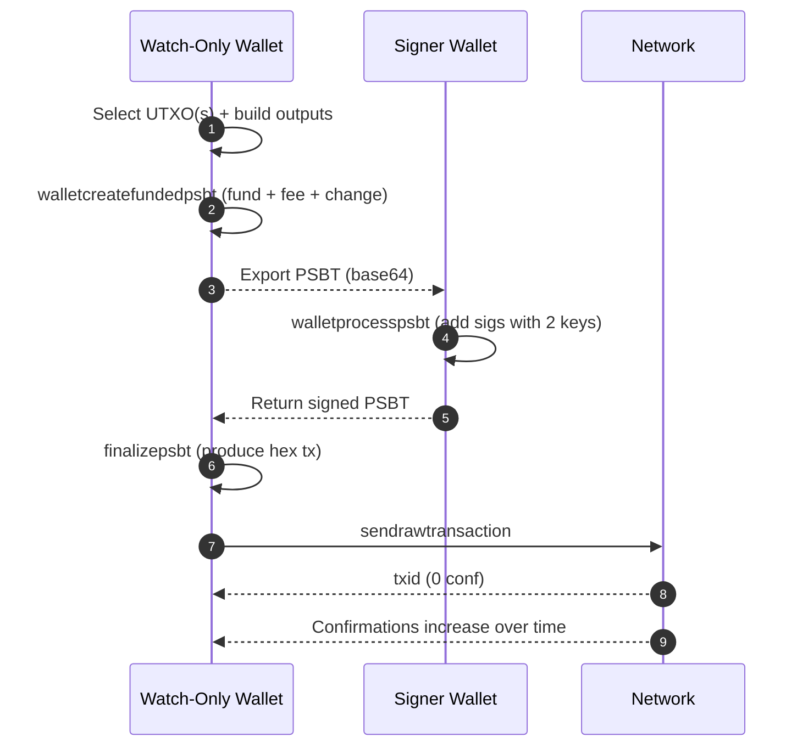
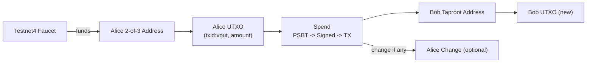
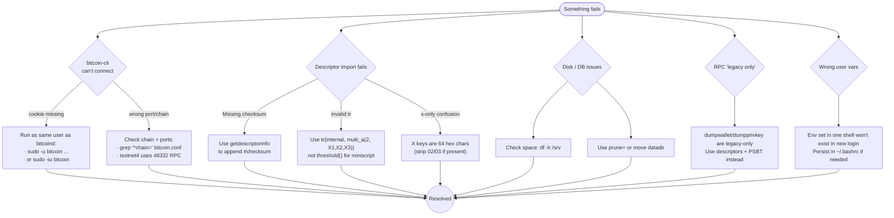
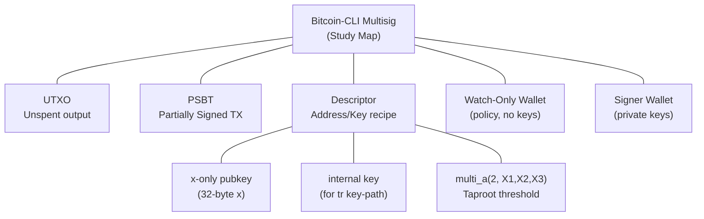

# Diagrams & Visual Walkthroughs

This document complements the shell walkthroughs by providing **visual diagrams** of the journey.  
The goal: make Bitcoin internals easier to remember by seeing how the moving parts connect.

---

## 1. User Journey: Alice → Bob (2-of-3 Taproot Multisig)

## 2. Wallet Roles: Signer vs. Watch-Only

## 3. Taproot Descriptor Anatomy

## 4. PSBT Lifecycle (end-to-end)

## 5. UTXO Flow (Before -> Spend -> After)

## 6. Troubleshooting Flow (Greatest Hits from Challenges.md)

## 7. Glossary Map (Quick Recall)
